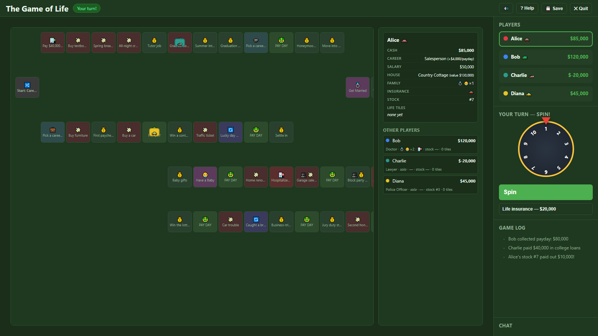
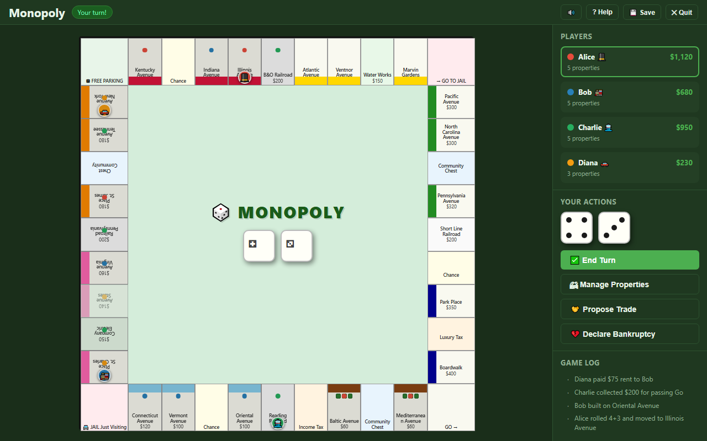
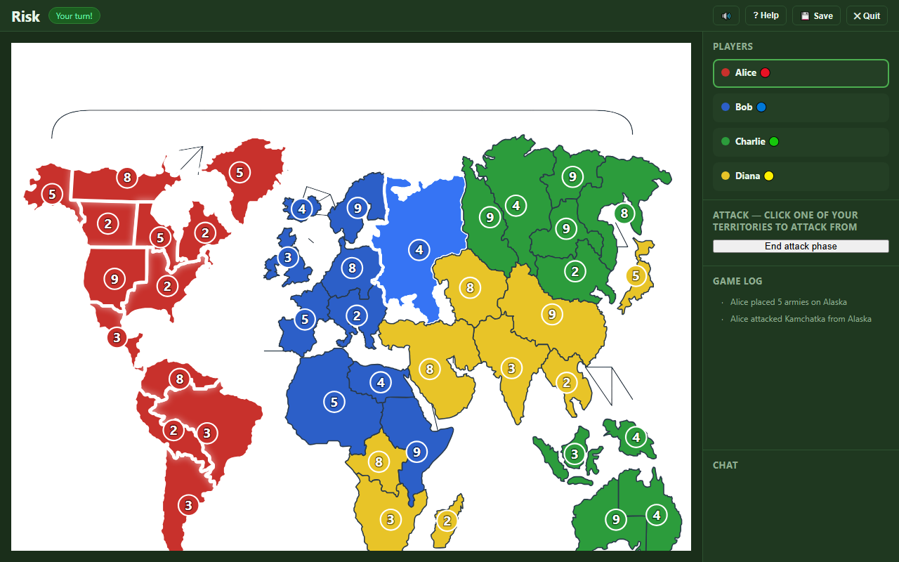
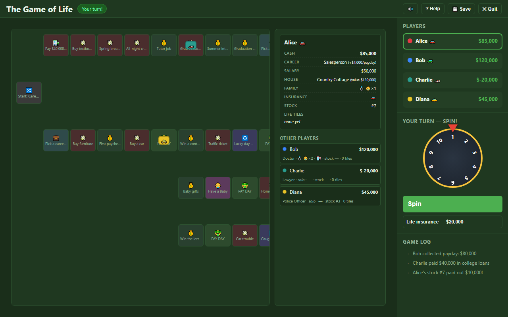
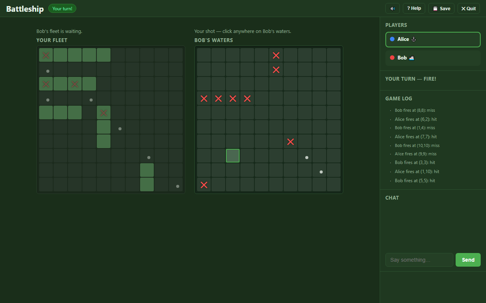
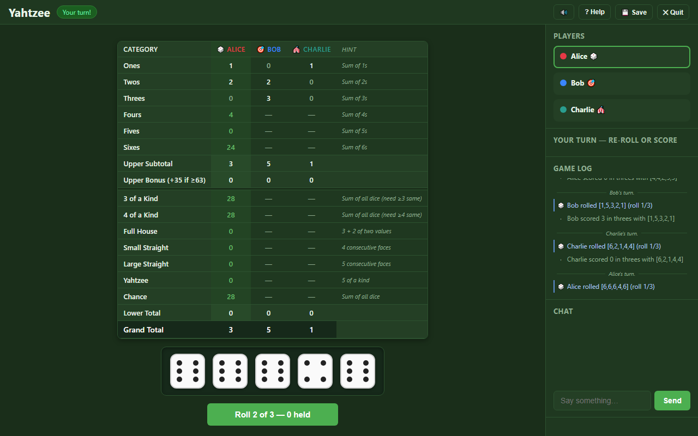
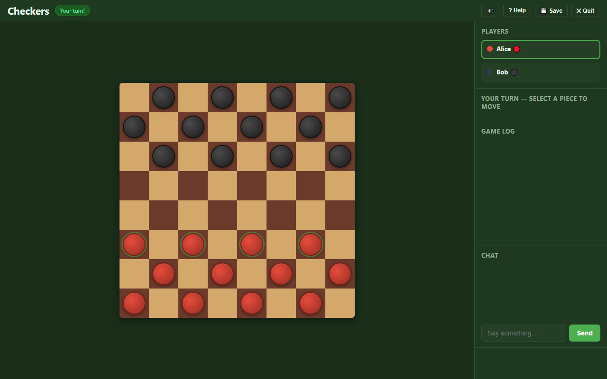
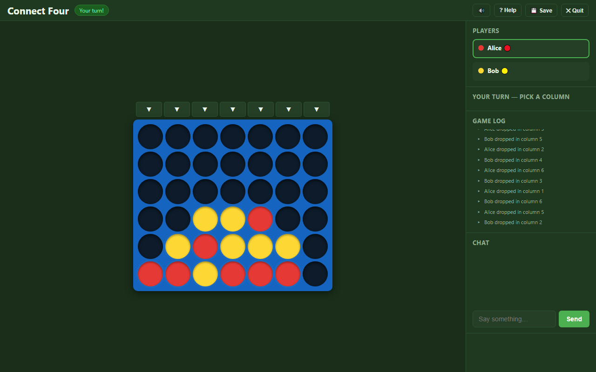
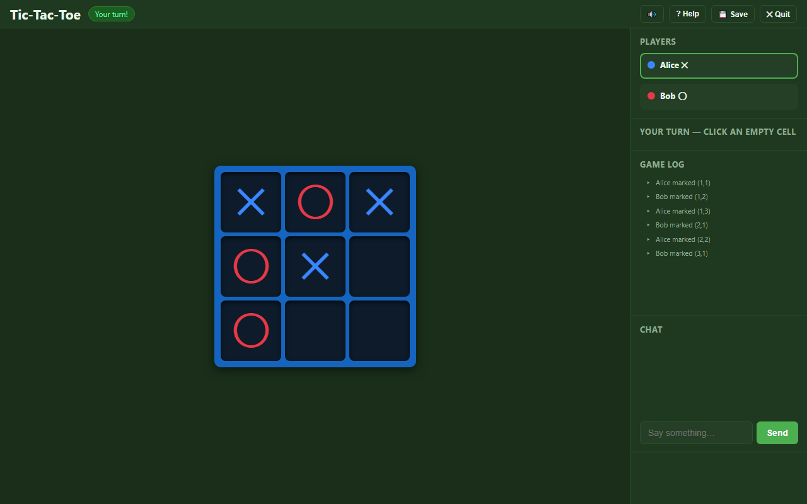

# LAN Games

> A self-hosted multiplayer game platform for LAN parties. Eight classic games with real-time play, hidden information, and spectator support — all running on a server you control.



[](LICENSE)

8 games · 660+ tests · single-server setup · Node.js 18+

---

## Why This Exists

LAN parties want games everyone in the room can play together. Most multiplayer games today require internet, accounts, and matchmaking — LAN Games is the opposite. One Node.js server on your network hosts eight turn-based board games in the browser. No accounts beyond a username, no internet after install, no configuration required. The platform is game-agnostic: each game is a server module behind a [small interface](server/src/game-logic-interface.js), so adding a ninth game doesn't touch the framework. Hidden-information games like Battleship and Risk coexist with open-board games through a per-game state-filtering contract, and spectators can watch any game with full visibility.

---

## Quickstart

1. **Clone and install:**
   ```bash
   git clone https://github.com/kbennett2000/lan-games.git
   cd lan-games/server
   npm install
   ```

2. **Start the server:**
   ```bash
   JWT_SECRET=change-me-to-something-secret npm start
   ```

3. **Play.** Open `http://localhost:3000` in your browser. Create a game, share the URL with friends on your network, and play.

No database setup, no external services, no configuration files. Docker is also supported — see the detailed [Quick Start](#quick-start) in the reference docs below.

---

## The Games

| | | |
|:---:|:---:|:---:|
| **Monopoly** <br> 2–8 players · ~90 min <br>  | **Risk** <br> 2–6 players · ~120 min <br>  | **The Game of Life** <br> 2–6 players · ~45 min <br>  |
| **Battleship** <br> 2 players · ~15 min <br>  | **Yahtzee** <br> 1–8 players · ~20 min <br>  | **Checkers** <br> 2 players · ~15 min <br>  |
| **Connect Four** <br> 2 players · ~5 min <br>  | **Tic-Tac-Toe** <br> 2 players · ~2 min <br>  | |

Every game supports save/resume, in-game chat, and spectator mode. Games with hidden information (Battleship, Risk, Life) enforce privacy server-side — each player sees only what they're allowed to.

---

## Table of Contents

[Why This Exists](#why-this-exists) · [Quickstart](#quickstart) · [The Games](#the-games)

**Reference Documentation**

1. [Features](#features)
2. [Documentation](#documentation)
3. [Quick Start (detailed)](#quick-start)
4. [Project Structure](#project-structure)
5. [How to Play](#how-to-play)
   — [Monopoly](#monopoly) · [Connect Four](#connect-four) · [Risk](#risk) · [Tic-Tac-Toe](#tic-tac-toe) · [Yahtzee](#yahtzee) · [Battleship](#battleship) · [Checkers](#checkers) · [The Game of Life](#the-game-of-life)
6. [Adding a New Game](#adding-a-new-game)
7. [Architecture](#architecture)
8. [Configuration](#configuration)
   — [Monopoly](#monopoly-settings) · [Connect Four](#connect-four-settings) · [Risk](#risk-settings) · [Tic-Tac-Toe](#tic-tac-toe-settings) · [Yahtzee](#yahtzee-settings) · [Battleship](#battleship-settings) · [Checkers](#checkers-settings) · [Life](#life-settings)
9. [API Reference](#api-reference)
10. [Socket.io Events](#socketio-events)
11. [Security Notes](#security-notes)
12. [Development](#development)
13. [Roadmap](#roadmap)

---

## Reference Documentation

*The sections below cover features, architecture, configuration, and API reference for development and customization.*

## Features

### Framework
- **Multi-game** — add any turn-based game by implementing one interface file; no framework changes required
- **Real-time multiplayer** — all clients sync instantly via Socket.io WebSockets
- **Player accounts** — register/login with username + password; JWT persisted in `localStorage`
- **Lobby** — create, browse, and join open games; game-type badge shown on every card
- **Save & Resume** — pause any in-progress game and continue it later from the lobby
- **Auto-reconnect** — disconnected players are marked AFK; their turn is auto-skipped after 30 s
- **In-game chat** — room-scoped, real-time, 300-character cap
- **Spectator mode** — anyone logged in can watch any game in progress (👁 Spectate button on every in-progress lobby card). Spectators see the full unfiltered state (including hidden information for games like Battleship, Risk, and Life), chat with players, and watch the action log; they cannot take actions. Players are notified when spectators join. See the "Spectator mode" section below.
- **Configurable** — every rule, price, and board value lives in JSON; hot-reload without a restart

### Monopoly
- Full rules: dice, doubles (3× → jail), property buying, auctions, rent, color-group monopoly detection, even-building rule, mortgage/unmortgage, jail (fine / doubles / card), Chance & Community Chest (full 16-card decks), trades (money + properties + jail cards), Income Tax (flat or 10% of net worth), bankruptcy with asset transfer
- Visual CSS Grid board with color bands, player tokens, house/hotel indicators, and ownership dots

### Connect Four
- Standard 7 × 6 board; drop pieces by clicking column buttons
- Win detection: horizontal, vertical, and both diagonals
- Draw detection when the board is full

### Risk
- Classic 42-territory world map across 6 continents; 2–6 players
- Three-phase turns: reinforce → attack → fortify
- Auto-distributed initial setup; armies and territories dealt evenly to all players
- Dice combat: attacker rolls up to 3, defender auto-rolls up to 2; ties go to defender
- Continent bonuses (NA 5, SA 2, EU 5, AF 3, AS 7, AU 2) applied at the start of every reinforce phase
- 44-card deck (42 territory + 2 wild); valid sets (3 of a kind, 3 different, or any 2 + wild) traded for escalating bonus armies (4, 6, 8, 10, 12, 15, then +5 each)
- Player elimination transfers all cards to the conqueror; last player standing wins by world domination
- **First game with hidden information** — each player's hand is private, enforced server-side by the game's `getStateForPlayer` filter

### Tic-Tac-Toe
- Classic 3 × 3 board; 2 players take turns marking cells with `✕` and `◯`
- Win detection: rows, columns, both diagonals
- Draw detection when the board fills

### Yahtzee
- Standard 5-dice, 13-category, three-rolls-per-turn rules; 1–8 players (solo play supported)
- Up to 3 rolls per turn with arbitrary holds between rolls
- All 13 categories (six upper + three-/four-of-a-kind, full house, two straights, Yahtzee, chance)
- Upper-section bonus (+35 when subtotal ≥ 63); ties produce a shared-winner array
- Two-click commit on category selection prevents accidental score-locking
- **First non-board game** — UI is a shared score sheet (players as columns, categories as rows) plus a dice tray, all inside the renderer-owned board area

### Battleship
- Classic 2-player, 10×10 grid; five ships per side (Carrier 5, Battleship 4, Cruiser 3, Submarine 3, Destroyer 2)
- Drag-and-drop ship placement with **R-key rotation** during drag
- Two-grid firing layout — your fleet on the left, opponent's waters on the right; fixed positions across turns with active/inactive treatment that flips
- Both fleets revealed at game over (winner and loser see the layout that beat them)
- **First game with a simultaneous private setup phase** — both players place ships in parallel; the phase transitions to firing on a barrier (both Ready) rather than via a turn. Modelled as `status='playing'` + `turnState.phase='setup'` with `currentPlayerIndex=null`
- **First game with fully hidden state per player** — opponents' ship positions are stripped by `getStateForPlayer` on every emit, not masked

### Checkers
- Classic American Checkers on an 8×8 board; 12 pieces per side, 2 players
- Diagonal movement with mandatory captures and multi-jump chain captures
- King coronation on reaching the back row (kings move forward and backward, one square at a time — not "flying" kings)
- Stalemate-as-loss: player with no legal move loses
- Click-driven move selection consuming server-supplied action descriptors — the renderer highlights only legal pieces and destinations
- Animated piece movement, capture fading, chain-capture sequencing, and king coronation visual

### The Game of Life
- 64-square branching board with a start fork (Career vs College), main track, and two-path retirement choice (Countryside Acres vs Millionaire Estates)
- 1–10 spinner (no dice) — CSS-animated wheel that decelerates and settles on the result
- College path costs $40,000 in loans but unlocks degree-required careers; career path skips the loan but is locked out of degree careers
- Marriage adds a spouse peg and collects $5,000 from each other player as wedding gifts
- Children mechanic — single births (+$5k/player) and twins (+$10k/player); each child counts toward final scoring at $50k each
- Insurance — auto and life, optional out-of-band purchases that nullify the matching accident squares
- Stocks — pick a number 1–10; collect $10,000 whenever **any** player's spinner matches it (cross-turn payouts)
- House purchase — pick from 2–3 offered house cards (cost vs scoring value); contributes to final score
- Retirement is the strategic crux: Countryside Acres draws life tiles from a shrinking deck; Millionaire Estates is a cash gamble that resolves at game over
- **First game with a branching, non-grid board** — squares are graph nodes with explicit `next[]` adjacency; the renderer places squares at hand-tuned grid coordinates with arrows showing direction
- **First game with deferred-resolution game over** — ME retirees' win/loss is undetermined until the last player retires; documented in [docs/renderer-contract.md](docs/renderer-contract.md)
- **First game with a "retired-but-still-in-game" pattern** — retired players stay in `state.players` and turn rotation skips past them; the game ends when every player is retired
- Life tiles are hidden information per player (count visible to opponents, values masked until game over); revealed with a per-tile flip animation during the final score reveal

---

## Documentation

In addition to this README, the project keeps three design docs under `docs/`:

- **[Action descriptors](docs/action-descriptors.md)** — optional interface
  for game-logic to supply dynamic action labels, enabled-state, and per-action
  data to renderers without forcing each renderer to mirror server-side rule
  logic. Implemented across five of the eight games (Battleship, Checkers, Risk,
  Yahtzee, and The Game of Life). Connect Four and Tic-Tac-Toe deliberately
  don't — their action surfaces are trivial enough that `getValidActions` covers them.
- **[Renderer contract notes](docs/renderer-contract.md)** — running design memo
  tracking open and resolved questions about the client-side renderer interface
  as it has evolved across game implementations.
- **[State-emission audit](docs/state-emission-audit.md)** — security audit that
  inventoried every state-bearing emit (socket and REST) and confirmed each
  routes through `getStateForPlayer`. Includes the audit's confidence statement
  and the closure of a real leak that was active when the audit ran.

---

## Quick Start

### Prerequisites

- **Node.js 18+** (LTS recommended) — *or* **Docker** (see below)
- No external database — SQLite is embedded via `better-sqlite3`

### Install & run

```bash
cd server
npm install
npm start          # production
npm run dev        # development (nodemon auto-restart)
```

The server binds to `0.0.0.0:3000` by default — reachable on your entire LAN.

### Docker

**1. Create a `.env` file** at the repo root containing your JWT secret (the server refuses to start without one):

```bash
# Generates a random secret and writes it to .env in one step
node -e "console.log('JWT_SECRET=' + require('crypto').randomBytes(48).toString('hex'))" > .env
```

**2. Build and start:**

```bash
docker compose up --build
```

The Dockerfile runs both the unit and integration test suites during the build — the image is only produced if all tests pass.

Open `http://localhost:3000`. The SQLite database is stored in a Docker named volume (`db-data`) and survives container restarts and image rebuilds.

**To reset the database inside the container:**

```bash
docker compose run --rm server node scripts/reset-db.js
```

### Connect

| Who | URL |
|-----|-----|
| Host machine | `http://localhost:3000` |
| LAN players | `http://<host-ip>:3000` |

Find `<host-ip>` with `ip addr` (Linux/macOS) or `ipconfig` (Windows).

### Play

1. Every player registers a username and password on their own browser.
2. One player creates a game, picks a game type, and optionally customises rules.
3. Other players join from the lobby.
4. The host clicks **Start Game**.

### Spectator mode

Anyone logged in can watch any in-progress game without playing.

- In the lobby, every game in `playing` status has a **👁 Spectate** button next to the Join/Rejoin button.
- A spectator sees the full unfiltered state — *including* hidden information like Battleship ship positions, Risk card hands, and Life tiles. (The point is to enjoy watching strategy unfold; spectators are watching, not playing.)
- Spectators can chat in the same room as players; their messages are prefixed with 👁 so players know which lines come from the gallery.
- Spectators see the action log, the player roster, and any in-progress modals.
- The action panel is hidden; the "You're spectating" banner persists at the top of the play area.
- Players are notified when a spectator joins (log entry). Leaves are silent.
- A spectator can leave any time via the **✕ Leave** button (replacing the host's Save/Quit). Leaving has no effect on the game.

Spectators cannot take actions. The server enforces this (any `game:action` from a spectator is rejected with a `game:error`); the client gates click handlers as a UX layer so spectator clicks don't appear to do anything.

A user who is already a player in a game cannot also spectate it — the Spectate button is suppressed in that case, and the server rejects an explicit attempt with "You are already a player in this game".

---

## Project Structure

```
lan-games/
├── README.md
├── docs/                         ← design notes & active proposals
│   ├── action-descriptors.md     ← optional rich-action interface (5 of 8 games adopted)
│   ├── renderer-contract.md      ← renderer / framework DOM contract; open questions
│   └── state-emission-audit.md   ← security audit of every state-bearing emit path
│
├── server/
│   ├── package.json
│   ├── scripts/
│   │   └── reset-db.js           ← wipe the database (--hard to also delete the file)
│   ├── data/                     ← created at runtime; holds lan-games.db (gitignored)
│   │
│   ├── games/                    ← one subdirectory per game type
│   │   ├── monopoly/
│   │   │   ├── game-logic.js     ← all Monopoly rules (pure functions)
│   │   │   ├── config-loader.js  ← loads & validates the three Monopoly config files
│   │   │   └── config/
│   │   │       ├── board.json    ← 40 board squares (names, prices, rents)
│   │   │       ├── cards.json    ← Chance & Community Chest decks
│   │   │       └── settings.json ← game rules (starting money, jail fine, …)
│   │   ├── connect-four/
│   │   │   ├── game-logic.js     ← Connect Four rules (pure functions)
│   │   │   └── config/
│   │   │       └── settings.json ← board dimensions, win length, colours
│   │   ├── risk/
│   │   │   ├── game-logic.js     ← Risk rules (pure functions)
│   │   │   └── config/
│   │   │       ├── board.json    ← 42 territories across 6 continents + adjacencies
│   │   │       ├── cards.json    ← 44-card deck (42 territory + 2 wild)
│   │   │       └── settings.json ← reinforcement formula, dice caps, card bonuses
│   │   ├── tic-tac-toe/
│   │   │   ├── game-logic.js     ← Tic-Tac-Toe rules (pure functions)
│   │   │   └── config/
│   │   │       └── settings.json ← board size, win length, colours, tokens
│   │   ├── yahtzee/
│   │   │   ├── game-logic.js     ← Yahtzee rules + scoring (pure functions)
│   │   │   └── config/
│   │   │       └── settings.json ← dice count, rolls per turn, category bonuses
│   │   ├── battleship/
│   │   │   ├── game-logic.js     ← Battleship rules + hidden-info filter (pure functions)
│   │   │   └── config/
│   │   │       └── settings.json ← grid size, ship list, first-player selection
│   │   ├── checkers/
│   │   │   ├── game-logic.js     ← Checkers rules (pure functions)
│   │   │   └── config/
│   │   │       └── settings.json ← board size, pieces per player, colours
│   │   └── life/
│   │       ├── game-logic.js     ← Life rules + scoring + hidden-info filter
│   │       ├── config-loader.js  ← loads & validates the six Life config files
│   │       └── config/
│   │           ├── board.json    ← 64 squares with effect types + next[] adjacency
│   │           ├── careers.json  ← 12 careers (6 degree-required, 6 not)
│   │           ├── salaries.json ← 6 salary tiers with tax-by-salary amounts
│   │           ├── houses.json   ← 5 houses (cost / scoring value pairs)
│   │           ├── lifeTiles.json← 20 achievement tiles drawn at CA retirement
│   │           └── settings.json ← starting cash, loan, gift / insurance / stock costs
│   │
│   └── src/                      ← game-agnostic framework
│       ├── index.js              ← entry point; HTTP + Socket.io server
│       ├── database.js           ← SQLite schema + query helpers (better-sqlite3)
│       ├── auth.js               ← bcrypt password hashing + JWT middleware
│       ├── game-logic-interface.js ← interface contract + validateImplementation()
│       ├── game-registry.js      ← maps game-type keys → logic modules
│       ├── game-manager.js       ← in-memory sessions + SQLite persistence
│       ├── state-filter.js       ← shared getStateForPlayer wrapper used by socket + REST
│       ├── socket-handler.js     ← Socket.io event routing
│       └── routes/
│           ├── auth.routes.js    ← /api/auth/*
│           └── game.routes.js    ← /api/games/*
│
└── client/
    ├── index.html                ← single-page application shell
    ├── css/
    │   └── main.css              ← all styles (dark green theme)
    └── js/
        ├── api.js                ← fetch() wrapper for REST calls
        ├── game-state.js         ← client-side state singleton
        ├── ui-manager.js         ← all DOM updates outside the board area
        ├── socket-client.js      ← Socket.io connection + event dispatch
        ├── sound-manager.js      ← audio cues
        ├── app.js                ← wires modules + DOM event listeners
        └── games/
            ├── renderer-interface.js  ← GameRenderer contract + runtime validator
            ├── renderer-registry.js   ← gameType → renderer lookup
            ├── monopoly/
            │   ├── board-grid.js      ← CSS Grid board builder
            │   └── renderer.js
            ├── connect-four/renderer.js
            ├── risk/renderer.js
            ├── tic-tac-toe/renderer.js
            ├── yahtzee/
            │   ├── renderer.js        ← lifecycle + dice tray + roll controls
            │   └── score-sheet.js     ← shared score-sheet table builder + painter
            ├── battleship/
            │   ├── grid.js            ← shared 10×10 grid primitive
            │   ├── setup-phase.js     ← drag-and-drop ship placement
            │   ├── firing-phase.js    ← two-grid shooting + sunk-ship cache
            │   └── renderer.js        ← lifecycle + phase routing
            ├── checkers/renderer.js
            └── life/
                ├── renderer.js        ← lifecycle + phase routing + sidebar title
                ├── board-view.js      ← 64-square board + player cars + movement queue
                ├── action-panel.js    ← phase-dependent actions + CSS-animated spinner
                └── card-display.js    ← inventory panel + game-over tile reveal animation
```

---

## How to Play

### Monopoly

#### Your turn

1. **Roll Dice** — moves your token; doubles let you roll again.
2. **Unowned property** — buy it or let it go to auction.
3. **Owned property** — rent is collected automatically.
4. **Chance / Community Chest** — card drawn and resolved automatically.
5. **Go to Jail** — landing on "Go to Jail" or rolling three consecutive doubles.
6. **End Turn** — passes to the next player.

#### Anytime on your turn (pre-roll or post-roll)

- **Manage Properties** — click any board square or the "Manage Properties" button to build houses/hotels or mortgage/unmortgage.
- **Propose Trade** — offer money, properties, and Get Out of Jail Free cards in any combination.
- **Declare Bankruptcy** — if you cannot pay a debt, all your assets transfer to the creditor (or the bank).

#### Jail

- Roll doubles to escape for free.
- Pay the $50 fine before rolling (configurable).
- Use a Get Out of Jail Free card.
- After 3 failed turns you must pay the fine and roll.

#### Winning

Last player standing (not bankrupt) wins.

---

### Connect Four

Click a **▼** button above any column to drop your piece.  
The game alternates turns automatically.  
**Win** by connecting 4 of your pieces in a row — horizontally, vertically, or diagonally.  
**Draw** when the board fills with no winner.

---

### Risk

Your turn has three phases. The sidebar's **End … phase** button advances to the next one.

#### 1. Reinforce

You start the phase with `max(3, ⌊territoriesOwned / 3⌋) + continent bonuses` armies to place.  
**Click any of your territories** to drop one army there. Repeat until your reserve hits zero, then **End reinforce phase**.

If your hand contains a valid 3-card set (3 of a kind, 1 of each, or 2+wild), the **Trade cards** button appears. Trading immediately adds the bonus armies to your reserve.

#### 2. Attack (optional)

**Click one of your territories** (with ≥ 2 armies) to select it as the attacker.  
**Click an adjacent enemy territory** to launch one round of combat. Dice are rolled server-side, ties go to the defender, and a conquered territory automatically receives your dice count in armies.  
Attack as many times as you want; click the source again to deselect. Click **End attack phase** when done.

If you conquer at least one territory this turn, you draw one card at end of turn.

#### 3. Fortify (one move per turn)

**Click your source territory**, then **a destination territory** reachable through your own land. A prompt asks how many armies to move (leaving at least 1 behind).  
Click **End turn** to pass.

#### Winning

Conquer every territory on the board.

---

### Tic-Tac-Toe

Click any empty cell on the 3 × 3 grid to mark it.  
The game alternates turns automatically between `✕` (first player) and `◯`.  
**Win** by getting three of your marks in a row — horizontally, vertically, or diagonally.  
**Draw** when the board fills with no winner.

---

### Yahtzee

#### Your turn

1. **Roll** — clicks the Roll button to roll all five dice. You get up to three rolls per turn.
2. **Hold** — click any die between rolls to keep it; click again to release. Held dice carry to the next roll; the Roll button shows "Roll N of 3 — K held".
3. **Score** — click any unscored category cell in your column to **preview** the score; click it again to **commit**. Clicking a different category moves the selection; clicking Roll cancels it.

A category is **locked** once scored — including categories scored at 0. Use `=== null` not falsy checks (a deliberate 0 is a real score). Two-click commit is the protection against accidental lock-in.

#### The score sheet

Players are columns, the 13 categories are rows. Your column shows live previews of every unscored category given the current dice; opponents' unscored cells stay blank. Summary rows show upper subtotal, upper bonus (+35 when subtotal ≥ 63), lower total, and grand total — all derived client-side.

#### Winning

After every player fills all 13 categories, the highest grand total wins. Ties produce a shared-winner array and the modal/log call out all tied players.

---

### Battleship

Battleship plays in two phases.

#### Setup phase

Both players are in setup at the same time — there's no turn order. Drag a ship from the **Unplaced ships** panel onto your grid; press **R while dragging** to rotate horizontal ↔ vertical. Ships highlight green for a valid placement, red for invalid. Click a placed ship to pick it back up and reposition it.

When all five ships are placed, click **Ready**. You can **Unready** until the opponent commits — once both players are Ready, the game transitions to firing.

#### Firing phase

Your fleet is on the left, the opponent's waters are on the right. On your turn, click any unshot cell of the opponent's grid to fire. Misses are marked with a dot, hits with a cross, and sunk ships reveal their full position. Turn passes after every shot regardless of result.

Sink all five of the opponent's ships to win. At game over both fleets are revealed.

---

### Checkers

Two players — Red and Black — on an 8×8 board with 12 pieces each. Red moves first. Pieces occupy only the dark squares and move diagonally forward, one square at a time.

Click an eligible piece (highlighted with a glow) to select it. Valid destinations appear as markers on the board. Click a destination to move. If your piece lands adjacent to an opponent's piece with an empty square beyond, it captures by jumping over — and if another jump is available from the new position, you must keep jumping (chain capture). Captures are mandatory: if any capture exists, you must take one.

When a regular piece reaches the opponent's back row, it is crowned a king (👑). Kings can move and capture diagonally in all four directions, but still one square at a time — this is American Checkers, not International Draughts. Coronation ends a chain capture even if more jumps would be available as a king.

**Win** by capturing all of your opponent's pieces, or by leaving them with no legal moves. Stalemate is a loss for the player who cannot move, not a draw.

### The Game of Life

Life plays in three phases: a start choice, the main track, and retirement. The board is a directed graph of 64 squares with branches and merges — your pawn (a small car with pegs for spouse and children) traverses it from the start square to one of two retirement terminals.

#### Phase 1 — Start choice

Your first action is **chooseBranch**: take the **Career** path or the **College** path.

- **Career** skips the loan and earns immediately, but draws from the non-degree-required career pool (smaller payday bonuses on average).
- **College** pays $40,000 in loans up front (your cash can go negative — that's fine) but unlocks the degree-required pool (Doctor, Lawyer, Computer Consultant, etc., with larger payday bonuses).

The server offers 2 career cards filtered by your path, then 2 salary cards. Your first turn ends after both choices are made.

#### Phase 2 — Main track

Each turn: spin (1–10), animate movement square-by-square, resolve the landing square's effect. Square types include payday (collect salary + career bonus), buy-house (pick from 3 offered houses), marry, have-baby/have-twins, auto-accident, life-accident (illness), spin-again, and pay-tax-by-salary (consumes your salary's `taxDue`).

Out-of-band actions available throughout your turn (when no decision is pending and you're not mid-spin-again):

- **Buy Auto Insurance** ($10,000) — nullifies auto-accident squares.
- **Buy Life Insurance** ($20,000) — nullifies life-accident squares.
- **Buy Stock** — pick a number 1–10 for $50,000. From then on, **whenever any player's spinner matches your number**, you collect $10,000. Each number can be owned by at most one player.

Marriage and children trigger collections from every other player: $5,000 wedding gift, $5,000 baby shower, $10,000 for twins. Your spouse and children show as pegs on your car for everyone to see.

#### Phase 3 — Retirement

Landing on the retirement-fork square pauses your turn for a deliberate choice:

- **Countryside Acres** is the safe path. On arrival you draw up to 4 life tiles from a shrinking deck. Tile values count toward your final score.
- **Millionaire Estates** is the gamble. No tiles. You retire with whatever cash you have, and the outcome **does not resolve until every player retires**. At game over, the highest-cash ME retiree wins the game outright; all other ME retirees score zero.

The strategic crux is the **life-tile race** — the deck holds 20 tiles, while up to 6 players × 4 tiles each = 24 possible draws. Late CA retirees may find the deck empty. Retiring early is a gamble against your own future earnings; retiring late is a gamble against the deck.

Retired players stay on the board (their cars sit on the terminal square with a "✓ Retired" badge) but are skipped in turn rotation. The game continues until every player has retired.

#### Final scoring

```
finalScore = cash
           + house.value
           + sum(lifeTiles[].value)
           + (children × $50,000)
```

If **any** player retired to Millionaire Estates, the highest-cash ME retiree(s) win outright and all other ME retirees score zero (regardless of their other holdings). If **no** player went ME, the highest-score Countryside Acres retiree wins. Ties produce a winners array — multiple winners share the championship.

Life tiles flip face-up one at a time during the game-over reveal animation, with a running total updating as each tile lands.

---

## Adding a New Game

The framework is intentionally game-agnostic. Adding a new game requires three steps:

### 1. Create `server/games/<your-game>/`

```
server/games/my-game/
├── game-logic.js
└── config/
    └── settings.json   (or however many config files you need)
```

### 2. Implement the GameLogic interface

`game-logic.js` must export all **required** methods. See [`server/src/game-logic-interface.js`](server/src/game-logic-interface.js) for the full JSDoc contract. Verify compliance at load time with `validateImplementation`:

```js
'use strict';

const {
  validateImplementation,
  defaultGetStateForPlayer, // use for perfect-information games; see below
} = require('../../src/game-logic-interface');

// Bump when the GameState shape changes incompatibly (see "State versioning" below).
const STATE_VERSION = 1;

// ... your game logic ...

module.exports = {
  // ── Required ──────────────────────────────────────────────────────
  initGame,            // (gameId, name, players, config) → GameState
  createInitialPlayer, // (user, existingPlayers, config) → PlayerObject
  applyAction,         // (state, userId, action, payload) → ActionResult
  skipTurn,            // (state, userId) → ActionResult
  getCurrentPlayer,    // (state) → { userId, username } | null
  isTurnTimerBlocked,  // (state) → boolean
  getValidActions,     // (state, userId) → string[]
  getGameMetadata,     // () → { name, minPlayers, maxPlayers, description, icon }
  loadConfig,          // () → config object
  getConfigCopy,       // () → deep-cloned config object
  getStateForPlayer,   // (state, userId) → player-specific view — see below

  // ── Optional ──────────────────────────────────────────────────────
  STATE_VERSION,       // number — current state schema version
  migrate,             // (oldState) → newState — see "State versioning" below
};

// Throws if any required method is missing
validateImplementation(module.exports);
```

`initGame` must stamp `stateVersion: STATE_VERSION` on the returned object so the framework can detect future schema drift.

#### getStateForPlayer and hidden information

`getStateForPlayer(state, userId)` is called before every socket emission so that each client receives only the information it is allowed to see.  You **must** implement it for every game.

| Game type | What to do |
|-----------|-----------|
| **Perfect information** (Monopoly, Connect Four, Tic-Tac-Toe, Checkers, Yahtzee) — every player sees the whole board | Use `defaultGetStateForPlayer` exported by the interface module |
| **Hidden information** (Battleship, Risk) — players have private board state or private cards | Write a real filter that masks other players' private fields |

```js
// ✓ Perfect-information game — one line, done.
getStateForPlayer: defaultGetStateForPlayer,

// ✓ Hidden-information game — mask every other player's hand.
function getStateForPlayer(state, userId) {
  return {
    ...state,
    players: state.players.map(p =>
      p.userId === userId
        ? p
        : { ...p, hand: p.hand.map(() => 'HIDDEN') }
    ),
  };
}
```

Using `defaultGetStateForPlayer` in a hidden-information game leaks every player's private data to every other player — it is only safe when there is nothing to hide.

#### State versioning

Every `GameState` carries a `stateVersion` field.  When you save a game and later change the state schema, previously persisted games may no longer match your new code.  The framework handles this automatically:

1. On load, `game-manager.js` compares `state.stateVersion` to `STATE_VERSION` exported by the game module.
2. If they differ and the module exports `migrate`, `migrate(state)` is called and the result is written back to the database.
3. If they differ and no `migrate` is exported, the framework logs a warning and loads the state as-is.
4. If `migrate` throws, the game is treated as unloadable and `null` is returned to the caller.

**When to bump `STATE_VERSION`:** any time you add, rename, or remove a field that existing saved games rely on (e.g. adding a required field with no default, changing the type of a field, restructuring a nested object).  Pure logic changes that don't touch the shape of state do not require a bump.

**How to write `migrate`:** chain `if (state.stateVersion < N)` blocks, one per version step, each producing a new state object and stamping the next version.  Throw at the end if the version is still not current (guards against states too old to migrate).

```js
function migrate(state) {
  let s = state;

  if (s.stateVersion < 2) {
    // v1 → v2: players gained an `energy` field defaulting to 10.
    s = {
      ...s,
      players:      s.players.map(p => ({ ...p, energy: 10 })),
      stateVersion: 2,
    };
  }

  if (s.stateVersion < 3) {
    // v2 → v3: top-level `deck` array replaced the old `hand` field.
    s = { ...s, deck: s.hand ?? [], stateVersion: 3 };
    delete s.hand;
  }

  if (s.stateVersion !== STATE_VERSION) {
    throw new Error(`No migration path from v${s.stateVersion} to v${STATE_VERSION}`);
  }

  return s;
}
```

**Key contracts:**

| Rule | Detail |
|------|--------|
| Pure functions | No I/O, no global mutation, no side effects |
| Immutable input | Never mutate `state` — always return a **new** object |
| In-band errors | Return `{ state, events: [], error: 'reason' }` instead of throwing |
| JSON-safe | `state` must survive `JSON.stringify` → `JSON.parse` |

#### Pending-state shape (optional convention)

The framework doesn't mandate how a game models "the player owes the server a follow-up action" — each game does what fits. Two shapes have emerged across the bundled games:

- **Phase-specific state machinery** (Battleship, Risk, Monopoly) — `turnState.phase` plus per-phase fields encode where the player is in a multi-step turn. Each phase has its own valid action set.
- **Discriminated-union pending field** (Life) — a single `player.pending = { type, options } \| null` field on each player record, where `type` is one of `'fork'`, `'career-draw'`, `'salary-draw'`, etc. The acting player's `getValidActions` switches on `pending.type`.

Pick whichever maps cleanly to your game. Life chose the union because it had four mutually-exclusive pending types (start fork, career draw, salary draw, retirement fork, house draw) that all shared the same "offer N options, player picks one" shape — the union expressed that uniformity. Battleship's phases are more divergent (setup is drag-and-drop, firing is click-to-shoot) so the phase enum carries more weight.

### 3. Register in `game-registry.js`

```js
// server/src/game-registry.js
const registry = {
  monopoly:      require('../games/monopoly/game-logic'),
  'connect-four': require('../games/connect-four/game-logic'),
  'my-game':     require('../games/my-game/game-logic'),  // ← add this line
};
```

That's it. The framework automatically:
- Exposes the game in `GET /api/games/types`
- Adds it to the client's game-type dropdown
- Routes all `game:action` socket events through your `applyAction`
- Saves and resumes game state via SQLite
- Runs the 30-second disconnect / turn-skip timer

### 4. (Optional) Add a client renderer

Create `client/js/games/<your-game>/renderer.js` implementing the `GameRenderer` interface defined in [`client/js/games/renderer-interface.js`](client/js/games/renderer-interface.js) — at minimum `init`, `update`, and `destroy`. Self-register at the bottom of the file:

```js
GameRendererRegistry.register('your-game', YourGameRenderer);
```

Add one `<script>` tag to `client/index.html`. No `app.js` or `socket-client.js` changes — the framework dispatches to the renderer via the registry based on `state.gameType`.

### 5. (Recommended) Implement `getActionDescriptors`

If your game has dynamic action labels, score previews, or enabled-state logic that depends on game rules (the renderer would otherwise have to mirror server-side rule logic), implement the `getActionDescriptors(state, userId)` method. Five of the eight bundled games (Battleship, Checkers, Risk, Yahtzee, Life) adopt it; only the two trivially-small action surfaces (Connect Four, Tic-Tac-Toe) skip it. See [`docs/action-descriptors.md`](docs/action-descriptors.md) for the contract. The framework attaches the descriptor list to `state.actionDescriptors` on every socket emit when the method is present. Games that don't implement it stay on the simpler `getValidActions` contract.

---

## Architecture

### Component overview

```
┌─────────────────────────────────────────────────────────┐
│                     Browser (Client)                    │
│  api.js ──── REST calls ────────────────────────────┐   │
│  socket-client.js ── Socket.io ──────────────────┐  │   │
│  games/<type>/renderer.js (via renderer-registry)│  │   │
│  ui-manager.js · app.js · game-state.js          │  │   │
└──────────────────────────────────────────────────┼──┼───┘
                                                   │  │
                         WebSocket (Socket.io)     │  │  HTTP REST
                                                   ▼  ▼
┌─────────────────────────────────────────────────────────┐
│                    Node.js Server                       │
│                                                         │
│  socket-handler.js                                      │
│    └── game-manager.applyAction()                       │
│           └── game-registry.getGameLogic(gameType)      │
│                  └── game-logic.applyAction()  ◄──────  │
│                        (pure function)                  │
│                                                         │
│  game-manager.js ──── persist ───► database.js (SQLite) │
│  auth.js (bcrypt + JWT)                                 │
│  routes/ (Express REST)                                 │
└─────────────────────────────────────────────────────────┘
```

### Data flow for a game action

```
1. Player clicks a button
      ↓
2. socket-client.js emits:  game:action  { action: 'rollDice' }
      ↓
3. socket-handler.js receives the event
      ↓
4. game-manager.applyAction(gameId, userId, 'rollDice', payload)
      ↓
5. game-registry.getGameLogic(state.gameType)  →  returns the correct module
      ↓
6. gameLogic.applyAction(state, userId, 'rollDice', payload)
      →  returns { state: newState, events: [...] }   (pure, no side effects)
      ↓
7. game-manager stores newState in memory + SQLite
      ↓
8. socket-handler broadcasts to the game room:
      io.to(gameId).emit('game:update', { state: newState, events })
      ↓
9. Every client's socket-client.js receives game:update
      ↓
10. UI updates: board, player panels, action buttons, game log, sounds
```

### Database schema

```sql
users (
  id            TEXT PRIMARY KEY,   -- UUID
  username      TEXT UNIQUE,
  password_hash TEXT,               -- bcrypt, 12 rounds
  created_at    INTEGER             -- Unix ms
)

games (
  id          TEXT PRIMARY KEY,     -- UUID
  name        TEXT,
  game_type   TEXT DEFAULT 'monopoly',
  status      TEXT,                 -- waiting | playing | paused | finished
  created_by  TEXT REFERENCES users(id),
  created_at  INTEGER,
  updated_at  INTEGER,
  state       TEXT,                 -- JSON-serialised GameState
  config      TEXT                  -- JSON-serialised config (snapshot at game start)
)

game_players (
  game_id   TEXT REFERENCES games(id) ON DELETE CASCADE,
  user_id   TEXT REFERENCES users(id),
  joined_at INTEGER,
  PRIMARY KEY (game_id, user_id)
)
```

### GameState shape (common fields)

Every game state object carries these top-level fields, regardless of game type:

```js
{
  id:         string,         // UUID — matches games.id
  name:       string,         // human-readable game name
  gameType:   string,         // 'monopoly' | 'connect-four' | …
  createdBy:  string,         // userId of the host
  status:     'waiting' | 'playing' | 'paused' | 'finished',
  config:     object,         // full config snapshot (game-specific shape)
  minPlayers: number,         // from getGameMetadata() — used by the waiting-room UI
  maxPlayers: number,
  players:    PlayerObject[], // game-specific player records
  turnState:  object,         // game-specific turn tracking
  winner:     string | string[] | null,  // userId, or array of userIds for ties (Yahtzee, Life); null for draw; undefined for in-progress Monopoly-style games
  log:        LogEntry[],     // [{ message, type, timestamp }]
}
```

---

## Configuration

Each game owns its configuration under `server/games/<game>/config/`. The server reads these files on startup and validates them; existing in-progress games are not affected by config changes (the config is embedded in the state at game-start time). Hot-reload a game's config without a server restart via:

```
POST /api/games/types/:type/config/reload
```

---

### Monopoly Settings

`server/games/monopoly/config/settings.json`

| Key | Default | Description |
|-----|---------|-------------|
| `startingMoney` | 1500 | Amount each player starts with |
| `goSalary` | 200 | Amount collected when passing or landing on Go |
| `incomeTaxAmount` | 200 | Flat income tax option |
| `incomeTaxPercent` | 10 | Percent-of-net-worth income tax option |
| `incomeTaxChoice` | true | If `true`, player chooses whichever is lower |
| `luxuryTaxAmount` | 100 | Luxury Tax amount |
| `jailFine` | 50 | Cost to pay your way out of jail |
| `jailMaxTurns` | 3 | Turns in jail before the fine becomes mandatory |
| `maxHousesInBank` | 32 | Total houses the bank can supply |
| `maxHotelsInBank` | 12 | Total hotels the bank can supply |
| `auctionEnabled` | true | Auction when a player declines to buy |
| `auctionMinBid` | 1 | Minimum opening bid |
| `freeParkingJackpot` | false | Taxes and fines accumulate on Free Parking |
| `maxPlayers` | 8 | Maximum players per game |
| `minPlayersToStart` | 2 | Minimum players to start |
| `tradeEnabled` | true | Allow player-to-player trades |
| `bankruptcyToBank` | true | Bankrupt assets go to the bank, not the creditor |

---

### Monopoly Board / Properties

`server/games/monopoly/config/board.json` — array of 40 objects, one per square (index 0 = Go, 39 = last square).

**Property square**
```json
{
  "position":       1,
  "type":           "property",
  "name":           "Mediterranean Avenue",
  "colorGroup":     "brown",
  "price":          60,
  "houseCost":      50,
  "hotelCost":      50,
  "mortgage":       30,
  "unmortgageCost": 33,
  "rent": {
    "base":        2,
    "monopoly":    4,
    "oneHouse":    10,
    "twoHouses":   30,
    "threeHouses": 90,
    "fourHouses":  160,
    "hotel":       250
  }
}
```

**Railroad square**
```json
{
  "position": 5,
  "type":     "railroad",
  "name":     "Reading Railroad",
  "price":    200,
  "mortgage": 100,
  "unmortgageCost": 110,
  "rent": { "owned1": 25, "owned2": 50, "owned3": 100, "owned4": 200 }
}
```

**Utility square**
```json
{
  "position": 12,
  "type":     "utility",
  "name":     "Electric Company",
  "price":    150,
  "mortgage": 75,
  "unmortgageCost": 83,
  "rent": { "multiplier1": 4, "multiplier2": 10 }
}
```

---

### Monopoly Cards

`server/games/monopoly/config/cards.json` — two arrays: `chance` and `communityChest` (16 cards each).

```json
{
  "id":     "ch_advance_go",
  "text":   "Advance to Go. Collect $200.",
  "action": "advance_to",
  "data":   { "position": 0, "collectGoSalary": true }
}
```

**Supported `action` values:**

| Action | `data` fields | Effect |
|--------|---------------|--------|
| `advance_to` | `position`, `collectGoSalary` | Move token to board position |
| `advance_to_nearest` | `type` (`railroad`/`utility`), `collectGoSalary`, `rentMultiplier` | Move to nearest of that type |
| `collect` | `amount` | Player receives money from bank |
| `pay` | `amount` | Player pays bank |
| `pay_each_player` | `amount` | Player pays every other player |
| `collect_from_each_player` | `amount` | Player collects from every other player |
| `go_to_jail` | — | Send to jail immediately |
| `get_out_of_jail` | — | Player receives a Get Out of Jail Free card |
| `go_back` | `spaces` | Move back N spaces |
| `repairs` | `houseCost`, `hotelCost` | Charge per house and per hotel owned |

The deck reshuffles automatically when exhausted.

---

### Connect Four Settings

`server/games/connect-four/config/settings.json`

| Key | Default | Description |
|-----|---------|-------------|
| `boardWidth` | 7 | Number of columns |
| `boardHeight` | 6 | Number of rows |
| `winLength` | 4 | Pieces in a row required to win |
| `playerColors` | red, yellow | Array of `{ id, hex }` colour objects |
| `playerTokens` | 🔴, 🟡 | Emoji tokens shown in the player panel |

---

### Risk Settings

`server/games/risk/config/settings.json`

| Key | Default | Description |
|-----|---------|-------------|
| `initialArmiesByPlayerCount` | `{2:40,3:35,4:30,5:25,6:20}` | Starting armies per player as a function of player count |
| `reinforcementMinimum` | 3 | Minimum armies per reinforce phase |
| `reinforcementDivisor` | 3 | Base reinforcements = `floor(territoriesOwned / divisor)` |
| `cardTradeBonuses` | `[4, 6, 8, 10, 12, 15]` | Bonus armies for the 1st, 2nd, … sets traded |
| `cardTradeIncrement` | 5 | Added to the last bonus for each set beyond the array |
| `attackerMaxDice` | 3 | Max dice per attack |
| `defenderMaxDice` | 2 | Max dice per defence |
| `defenderDicePolicy` | `"auto-max"` | Defender always rolls as many dice as possible (no interactive choice) |
| `minArmiesToAttack` | 2 | Source territory must have at least this many armies to attack |
| `maxAttacksPerTurn` | `null` | No limit |
| `fortifyOncePerTurn` | true | Single fortify move per turn (classic rule) |
| `winCondition` | `"world-domination"` | Only victory mode supported |
| `minPlayers` | 2 | |
| `maxPlayers` | 6 | |
| `playerColors` | 6 entries | Array of `{ id, hex }` |
| `playerTokens` | 🔴 🔵 🟢 🟡 🟣 ⚫ | Emoji tokens shown in the player panel |

---

### Risk Board / Territories

`server/games/risk/config/board.json`

The board is an object with two keys: `continents` and `territories`. Continents declare a name, an army bonus, and the list of member territory ids:

```json
{
  "continents": {
    "north-america": { "name": "North America", "bonus": 5, "territories": [...9 ids] },
    "australia":     { "name": "Australia",     "bonus": 2, "territories": [...4 ids] }
  },
  "territories": [
    {
      "id":        "alaska",
      "name":      "Alaska",
      "continent": "north-america",
      "adjacent":  ["northwest-territory", "alberta", "kamchatka"]
    }
  ]
}
```

Adjacencies are validated at load time as **symmetric** — if A lists B as a neighbour, B must list A. Each continent's `territories` array must exactly match the set of territories whose `continent` field points to it.

### Risk Cards

`server/games/risk/config/cards.json`

44 cards total: 42 territory cards plus 2 wilds. A territory card has a `troopType` of `infantry`, `cavalry`, or `artillery` and a `territoryId` matching a board territory. Wild cards have `troopType: "wild"` and `territoryId: null`.

```json
{
  "cards": [
    { "id": "card-alaska",  "territoryId": "alaska",  "troopType": "infantry" },
    { "id": "card-wild-1",  "territoryId": null,      "troopType": "wild" }
  ]
}
```

A valid trade-in is exactly 3 cards forming one of:
- Three of the same troop type
- One of each of the three troop types
- Any 2 cards plus a wild

Trading a card whose `territoryId` you currently own grants +2 extra armies on that territory.

---

### Tic-Tac-Toe Settings

`server/games/tic-tac-toe/config/settings.json`

| Key | Default | Description |
|-----|---------|-------------|
| `boardSize` | 3 | Square board edge length (also used as default `winLength`) |
| `winLength` | 3 | Marks in a row required to win |
| `playerColors` | x, o | Array of `{ id, hex }` colour objects |
| `playerTokens` | ✕, ◯ | Symbols shown in each cell |

---

### Yahtzee Settings

`server/games/yahtzee/config/settings.json`

| Key | Default | Description |
|-----|---------|-------------|
| `diceCount` | 5 | Number of dice rolled per turn |
| `diceFaces` | 6 | Faces per die |
| `rollsPerTurn` | 3 | Maximum rolls a player gets each turn |
| `upperBonusThreshold` | 63 | Upper-section subtotal needed for the bonus |
| `upperBonus` | 35 | Bonus awarded when the upper subtotal reaches the threshold |
| `fullHouseScore` | 25 | Fixed score for a full house |
| `smallStraightScore` | 30 | Fixed score for a small straight (4 consecutive faces) |
| `largeStraightScore` | 40 | Fixed score for a large straight (5 consecutive faces) |
| `yahtzeeScore` | 50 | Fixed score for five of a kind |
| `minPlayers` | 1 | Solo play supported |
| `maxPlayers` | 8 | |
| `playerColors` | 8 entries | Array of `{ id, hex }` |
| `playerTokens` | 🎲 🎯 🎪 🎨 🎭 🎰 🎳 🎱 | Emoji tokens shown in the player panel |

---

### Battleship Settings

`server/games/battleship/config/settings.json`

| Key | Default | Description |
|-----|---------|-------------|
| `gridWidth` | 10 | Grid width in cells |
| `gridHeight` | 10 | Grid height in cells |
| `ships` | 5-entry array | Each entry is `{ id, name, length }`. Defaults are Carrier (5), Battleship (4), Cruiser (3), Submarine (3), Destroyer (2). |
| `firstPlayerSelection` | `"random"` | Strategy for picking who fires first once both players are Ready. Only `"random"` is implemented in v1; other values are rejected by `loadConfig` with an explicit error. |
| `minPlayers` | 2 | Battleship is 2-player; v1 does not support N-player variants. |
| `maxPlayers` | 2 | |
| `playerColors` | blue, red | Array of `{ id, hex }` |
| `playerTokens` | ⚓ 🚢 | Emoji tokens shown in the player panel |

---

### Checkers Settings

`server/games/checkers/config/settings.json`

| Key | Default | Description |
|-----|---------|-------------|
| `boardSize` | 8 | Square board edge length (standard checkers is always 8) |
| `piecesPerPlayer` | 12 | Starting pieces per side |
| `playerColors` | red, black | Array of `{ id, hex }` colour objects |
| `playerTokens` | 🔴, ⚫ | Emoji tokens shown in the player panel |

Checkers is strictly 2-player; there is no `minPlayers`/`maxPlayers` in the config — the game metadata hardcodes both to 2.

---

### Life Settings

`server/games/life/config/settings.json`

| Key | Default | Description |
|-----|---------|-------------|
| `startingCash` | 10000 | Cash each player begins with |
| `collegeLoanAmount` | 40000 | Debited from cash on the college path's first square; cash may go negative |
| `spinMin` | 1 | Lower bound of the spinner |
| `spinMax` | 10 | Upper bound; also the count of stock numbers |
| `startSquareId` | `"sq-000-start"` | Board square every player begins on |
| `mainTrackEntrySquareId` | `"sq-m01-marry"` | First main-track square (where the college and career paths merge) |
| `careerOptionsCount` | 2 | Career cards offered per draw |
| `salaryOptionsCount` | 2 | Salary cards offered per draw |
| `houseOptionsCount` | 3 | House cards offered per draw |
| `weddingGiftPerPlayer` | 5000 | Marriage square: collected from each other active player |
| `babyGiftPerPlayer` | 5000 | Baby square: collected from each other active player |
| `twinsGiftPerPlayer` | 10000 | Twins square: doubled per-player collection (one baby shower for each twin) |
| `autoInsuranceCost` | 10000 | Cost to buy auto insurance |
| `autoAccidentCost` | 10000 | Charge on the auto-accident square (nullified by insurance) |
| `lifeInsuranceCost` | 20000 | Cost to buy life insurance |
| `lifeAccidentCost` | 20000 | Charge on the life-accident square (nullified by insurance) |
| `stockCost` | 50000 | One-time cost to buy a stock (one per player) |
| `stockPayoutAmount` | 10000 | Payout to the stock owner whenever **any** player's spinner matches |
| `caTilesPerRetiree` | 4 | Life tiles drawn at Countryside Acres retirement (deck has 20 tiles total — capped at remaining) |
| `childScoreBonus` | 50000 | Per-child bonus in the final score formula |
| `minPlayers` | 2 | |
| `maxPlayers` | 6 | |
| `playerColors` | 6 entries | Array of `{ id, hex, label }` |
| `playerTokens` | 🚗 🚙 🏎️ 🚕 🚐 🛻 | Vehicle emojis shown on player cars |

### Life Cards

Life ships four card decks, each loaded from its own JSON config and validated by `config-loader.js` (unique IDs, positive numeric fields, deck non-empty).

`server/games/life/config/careers.json` — 12 careers, 6 with `degreeRequired: true` and 6 without. Filtering happens at draw time so the college path can only be offered degree-required cards and vice versa.

| Field | Type | Notes |
|-------|------|-------|
| `id` | string | unique |
| `name` | string | display name (Doctor, Salesperson, …) |
| `degreeRequired` | boolean | gates which path can draw the card |
| `paydayBonus` | number | added to salary on every PAY DAY square |

`server/games/life/config/salaries.json` — 6 salary tiers from $30k to $80k.

| Field | Type | Notes |
|-------|------|-------|
| `id` | string | unique |
| `amount` | number | paid on every PAY DAY square |
| `taxDue` | number | charged on the `pay-tax-by-salary` square |

`server/games/life/config/houses.json` — 5 houses; cost is what the player pays, value is what the house contributes to final scoring.

| Field | Type | Notes |
|-------|------|-------|
| `id` | string | unique |
| `name` | string | "Starter Home", "Mansion", … |
| `cost` | number | deducted from cash on chooseHouse |
| `value` | number | added to final score (typically > cost so houses are profitable) |

`server/games/life/config/lifeTiles.json` — 20 achievement tiles drawn at Countryside Acres retirement.

| Field | Type | Notes |
|-------|------|-------|
| `id` | string | unique |
| `name` | string | "Win Nobel Prize", "Climb Mt. Everest", … |
| `value` | number | added to final score; $100,000–$300,000 |

### Life Board

`server/games/life/config/board.json` — 64 squares modelled as a directed graph. Each square is `{ id, type, label, next[], data? }`:

- `id` — unique kebab-case identifier, e.g. `sq-c01-career-pick`.
- `type` — effect identifier dispatched by the `EFFECTS` registry in `game-logic.js`. See list below.
- `label` — human-readable name displayed by the renderer.
- `next` — array of square IDs. Single entry = linear; multiple entries = a fork.
- `data` — type-specific data (e.g. `{ amount: 5000 }` for pay-bank squares).

The board is composed of:

- **Start fork** (`sq-000-start`) — the only land-on fork that every player traverses. Two branches: `sq-c01-career-pick` (career path, 10 squares) and `sq-u01-college-loan` (college path, 12 squares).
- **Path merge** — both paths terminate on the main-track entry square (`sq-m01-marry`) via their respective junction squares.
- **Main track** (35 squares) — payday squares interleaved with life-event squares, accidents, taxes, and the buy-house, marry, have-baby, have-twins, retirement-fork squares.
- **Retirement fork** (`sq-m35-retirement-fork`) — branches to `sq-r-countryside-01` or `sq-r-millionaire-01`. The terminal squares (`sq-r-countryside-end`, `sq-r-millionaire-end`) have empty `next` arrays — a retired player stays there.

**Land-on forks only.** When the spinner moves a player through a fork mid-traversal, the server always takes `next[0]` automatically — passthrough forks aren't player choices. Only when a player **lands on** a fork (the start fork on their first turn, and the retirement fork) does the server pause for a `chooseBranch` action. This is a deliberate v1 simplification documented in [`game-logic.js`](server/games/life/game-logic.js).

Known effect types (see `KNOWN_EFFECT_TYPES` in `config-loader.js`):

`career-fork`, `draw-career-degree`, `draw-career-no-degree`, `draw-salary`, `pay-loans`, `pay-bank`, `pay-tax-by-salary`, `collect-bank`, `pay-each-player`, `collect-each-player`, `payday`, `spin-again`, `marry`, `have-baby`, `have-twins`, `buy-house`, `auto-accident`, `life-accident`, `retirement-fork`, `countryside-retirement`, `millionaire-retirement`.

---

## API Reference

All endpoints live under `/api`. Authenticated endpoints (`✓`) require:

```
Authorization: Bearer <jwt-token>
```

### Auth

| Method | Path | Auth | Body | Response |
|--------|------|:----:|------|----------|
| POST | `/api/auth/register` | | `{ username, password }` | `{ token, user }` |
| POST | `/api/auth/login` | | `{ username, password }` | `{ token, user }` |
| GET | `/api/auth/me` | ✓ | — | `{ id, username }` |

### Games

| Method | Path | Auth | Body | Response |
|--------|------|:----:|------|----------|
| GET | `/api/games` | ✓ | — | `{ games[] }` — open & in-progress |
| GET | `/api/games/saved` | ✓ | — | `{ games[] }` — paused games for current user |
| GET | `/api/games/mine` | ✓ | — | `{ games[] }` — active games the user is in |
| GET | `/api/games/types` | ✓ | — | `{ types[] }` — registered game types + metadata |
| GET | `/api/games/types/:type/config` | ✓ | — | `{ config }` — default config for game type |
| POST | `/api/games/types/:type/config/reload` | ✓ | — | `{ success, config }` — hot-reload from disk |
| GET | `/api/games/config/default` | ✓ | — | `{ config }` — alias for Monopoly default config |
| POST | `/api/games` | ✓ | `{ name, gameType?, configOverrides? }` | `{ gameId, state }` |
| GET | `/api/games/:id` | ✓ | — | `{ state }` |
| POST | `/api/games/:id/join` | ✓ | — | `{ state }` |
| POST | `/api/games/:id/start` | ✓ (host) | — | `{ state }` |
| POST | `/api/games/:id/save` | ✓ (host) | — | `{ success }` |
| DELETE | `/api/games/:id` | ✓ (host) | — | `{ success }` |

`configOverrides` follows the same shape as the game's `settings.json` and is merged at game-creation time. Only `waiting` and `paused` games can be deleted.

---

## Socket.io Events

### Client → Server

| Event | Payload | Description |
|-------|---------|-------------|
| `join_game` | `gameId` | Join the Socket.io room for a game; server replies with full state |
| `leave_game` | — | Leave current game room |
| `lobby:join` | `gameId` | Join a waiting-room lobby (adds player to the roster) |
| `game:start` | — | Host starts the game |
| `game:action` | `{ action, ...payload }` | **Universal action event** — all player moves use this single event |
| `game:save` | — | Save (pause) the current game |
| `chat:message` | `{ text }` | Send a chat message to the game room |

#### `game:action` — action names by game

**Monopoly**

| `action` | Extra payload | Effect |
|----------|--------------|--------|
| `rollDice` | — | Roll and move |
| `buyProperty` | — | Buy the current square |
| `declinePurchase` | — | Decline; triggers auction if enabled |
| `placeBid` | `{ amount }` | Place a bid in an ongoing auction |
| `passAuction` | — | Pass on the current auction |
| `endTurn` | — | End the current turn |
| `payJailFine` | — | Pay to leave jail |
| `useJailCard` | — | Use a Get Out of Jail Free card |
| `buildHouse` | `{ position }` | Build a house or hotel |
| `sellHouse` | `{ position }` | Sell a house or hotel |
| `mortgageProperty` | `{ position }` | Mortgage a property |
| `unmortgageProperty` | `{ position }` | Unmortgage a property |
| `offerTrade` | `{ toUserId, offerMoney, offerProps, offerCards, requestMoney, requestProps, requestCards }` | Propose a trade |
| `acceptTrade` | — | Accept a pending trade offer |
| `rejectTrade` | — | Reject a pending trade offer |
| `cancelTrade` | — | Cancel an outgoing trade offer |
| `declareBankruptcy` | — | Eliminate yourself and transfer assets |

**Connect Four**

| `action` | Extra payload | Effect |
|----------|--------------|--------|
| `dropPiece` | `{ column }` | Drop a piece into the given column (0-indexed) |

**Tic-Tac-Toe**

| `action` | Extra payload | Effect |
|----------|--------------|--------|
| `markCell` | `{ row, col }` | Mark the cell at (row, col); both 0-indexed |

**Yahtzee**

| `action` | Extra payload | Effect |
|----------|--------------|--------|
| `rollDice` | `{ held? }` | Roll the dice; `held` is a boolean array indicating which dice carry over from the previous roll (omit on the first roll of a turn) |
| `scoreCategory` | `{ category }` | Commit the current dice to the named category; locks the cell. Category strings: `ones`, `twos`, …, `sixes`, `threeOfAKind`, `fourOfAKind`, `fullHouse`, `smallStraight`, `largeStraight`, `yahtzee`, `chance` |

**Battleship**

| `action` | Extra payload | Valid in phase | Effect |
|----------|--------------|----------------|--------|
| `placeShip` | `{ shipId, origin: {x, y}, orientation }` | setup | Place or reposition one ship. Validates bounds, no-overlap, and not-yet-Ready. |
| `removeShip` | `{ shipId }` | setup | Return a placed ship to the unplaced pool. |
| `commitPlacement` | — | setup | Mark this player Ready. Requires all 5 ships placed. Auto-transitions to firing when both players are Ready. |
| `uncommitPlacement` | — | setup | Un-Ready. Only valid while the phase is still `setup` (i.e. the opponent hasn't also Ready'd yet). |
| `fireShot` | `{ cell: {x, y} }` | firing | Fire at a cell on the opponent's grid. Result (`hit` / `miss` / `sunk`) is recorded in both players' shot logs. Turn passes regardless of result. |

**Risk**

| `action` | Extra payload | Valid in phase | Effect |
|----------|--------------|----------------|--------|
| `placeReinforcement` | `{ territoryId, count }` | reinforce | Add armies to one of your territories |
| `tradeCards` | `{ cardIds: [id, id, id] }` | reinforce | Trade a 3-card set for escalating bonus armies |
| `endReinforcePhase` | — | reinforce | Advance to attack (only when no armies remain) |
| `attackTerritory` | `{ from, to, attackerDice }` | attack | One round of combat; defender auto-rolls max dice |
| `endAttackPhase` | — | attack | Advance to fortify |
| `fortify` | `{ from, to, count }` | fortify | Move armies through a connected friendly chain (once per turn) |
| `endTurn` | — | fortify | End turn and draw a card if you conquered at least one territory |
| `declareBankruptcy` | — | any | Eliminate yourself; all your territories become neutral and your cards are discarded |

**Checkers**

| `action` | Extra payload | Effect |
|----------|--------------|--------|
| `move` | `{ from: { row, col }, to: { row, col } }` | Move a piece; may capture, chain, or crown |
| `skipTurn` | — | Framework disconnect timer (not player-initiated) |

**The Game of Life**

The active action depends on the player's `pending` field — a discriminated union of pending choices. When `pending` is `null` and it's your turn, you can `spin` plus any of the out-of-band purchase actions.

| `action` | Extra payload | Valid when | Effect |
|----------|--------------|------------|--------|
| `spin` | — | `pending === null`, not retired | Generate 1–10, animate movement, resolve landing-square effect |
| `chooseBranch` | `{ nextSquareId }` | `pending.type === 'fork' \|\| 'retirement-fork'` | Pick a fork direction (start fork or retirement fork) |
| `chooseCareer` | `{ cardId }` | `pending.type === 'career-draw'` | Pick from 2 offered career cards; chains directly into the salary draw |
| `chooseSalary` | `{ cardId }` | `pending.type === 'salary-draw'` | Pick from 2 offered salary cards |
| `chooseHouse` | `{ houseId }` | `pending.type === 'house-draw'` | Pick from 3 offered house cards; rejects with an error if the chosen house is unaffordable (pending stays so you can pick a cheaper one) |
| `buyAutoInsurance` | — | your turn, no pending, not mid-spin-again | $10,000; nullifies auto-accident squares |
| `buyLifeInsurance` | — | same | $20,000; nullifies life-accident squares |
| `buyStock` | `{ number }` | same; one stock per player; number 1–10 must not be already owned | $50,000; pays $10k whenever any player's spinner matches |
| `endTurn` | — | your turn, no pending | Rarely needed — most turns auto-end after effect resolution |
| `skipTurn` | (framework-internal) | your turn | Auto-skip on disconnect timer |

### Server → Client

| Event | Payload | Description |
|-------|---------|-------------|
| `game:state` | `{ state }` | Full state sync — sent on join or reconnect |
| `game:update` | `{ state, events[] }` | Incremental update after every action |
| `game:error` | `{ message }` | Action rejected — sent only to the acting socket |
| `game:saved` | `{ savedBy }` | Game was saved |
| `trade:incoming` | `{ from, payload }` | Targeted directly to the trade recipient |
| `chat:message` | `{ username, text, timestamp }` | Chat message broadcast to the room |
| `lobby:update` | — | Broadcast to all sockets; clients on the lobby screen refresh their game list |
| `game:turn_warning` | `{ username, deadlineTimestamp }` | Disconnected player's turn will auto-skip; `deadlineTimestamp` is Unix ms when the skip fires |
| `auth:error` | `{ message }` | Auth failure; socket is disconnected after this |

#### Game events (inside `game:update → events[]`)

Each event has `{ type, data, timestamp }`. Clients use these for sounds, animations, and log entries.

| `type` | Notable `data` fields |
|--------|-----------------------|
| `DICE_ROLLED` | `die1`, `die2`, `doubles` |
| `PLAYER_MOVED` | `username`, `from`, `to` |
| `PLAYER_LANDED` | `username`, `squareName` |
| `PASSED_GO` | `username`, `amount` |
| `PROPERTY_BOUGHT` | `username`, `name`, `price` |
| `AUCTION_STARTED` | `name`, `position`, `minBid` |
| `AUCTION_WON` | `username`, `name`, `amount` |
| `MONOPOLY_ACHIEVED` | `username`, `colorGroup` |
| `RENT_PAID` | `from`, `to`, `amount` |
| `CARD_DRAWN` | `username`, `card` |
| `BUILDING_BUILT` | `username`, `name`, `buildingType` |
| `TRADE_OFFERED` | `from`, `to` |
| `TRADE_ACCEPTED` | `from`, `to` |
| `PLAYER_BANKRUPT` | `username` |
| `PLAYER_JAILED` | `username` |
| `TURN_SKIPPED` | `username` |
| `PIECE_DROPPED` | `username`, `column`, `row` |
| `REINFORCEMENT_PLACED` *(Risk)* | `username`, `territoryId`, `count` |
| `CARDS_TRADED` *(Risk)* | `username`, `cardIds`, `bonusArmies`, `setNumber`, `territoryBonus`, `bonusTerritoryId` |
| `ATTACK_DECLARED` *(Risk)* | `from`, `to`, `attacker`, `defender`, `attackerDice`, `defenderDice` |
| `DICE_ROLLED` *(Risk variant)* | `from`, `to`, `attackerRolls[]`, `defenderRolls[]`, `attackerLosses`, `defenderLosses` |
| `TERRITORY_CONQUERED` *(Risk)* | `username`, `from`, `to`, `armiesMovedIn` |
| `ARMIES_FORTIFIED` *(Risk)* | `username`, `from`, `to`, `count` |
| `CONTINENT_HELD` *(Risk)* | `username`, `continent`, `bonus` |
| `CARD_DRAWN` *(Risk variant)* | `username` *(actual card is private — sent only inside the owning player's filtered state)* |
| `PHASE_CHANGED` *(Risk)* | `phase` (`reinforce` / `attack` / `fortify`), `username` |
| `PLAYER_ELIMINATED` *(Risk)* | `username`, `eliminatedBy` |
| `CELL_MARKED` *(Tic-Tac-Toe)* | `username`, `row`, `col`, `token` |
| `DICE_ROLLED` *(Yahtzee variant)* | `username`, `dice[]`, `held[]`, `rollsUsed` |
| `CATEGORY_SCORED` *(Yahtzee)* | `username`, `category`, `dice[]`, `points` |
| `TURN_STARTED` *(Yahtzee/Battleship)* | `username` |
| `TURN_ENDED` *(Yahtzee)* | `username` |
| `SHIP_PLACED` *(Battleship)* | `username`, `shipId` *(positions deliberately omitted — events are broadcast to both players)* |
| `SHIP_REMOVED` *(Battleship)* | `username`, `shipId` |
| `PLAYER_READY` *(Battleship)* | `username` |
| `PLAYER_UNREADY` *(Battleship)* | `username` |
| `SETUP_COMPLETE` *(Battleship)* | `firstPlayer` — the username who fires first after both players Ready |
| `SHOT_FIRED` *(Battleship)* | `shooter`, `target`, `cell: {x,y}`, `result: 'hit'|'miss'|'sunk'` |
| `SHIP_SUNK` *(Battleship)* | `owner`, `shipId`, `shipName`, `length`, `cells[]` *(cell footprint revealed on sink — by rule, sunk ships are no longer hidden)* |
| `PIECE_MOVED` *(Checkers)* | `username`, `from: {row, col}`, `to: {row, col}` |
| `PIECE_CAPTURED` *(Checkers)* | `username`, `capturedAt: {row, col}`, `by: {row, col}` |
| `PIECE_CROWNED` *(Checkers)* | `username`, `position: {row, col}` |
| `CHAIN_CONTINUE` *(Checkers)* | `piece: {row, col}` *(the piece must continue capturing)* |
| `CHAIN_ABANDONED` *(Checkers)* | `username`, `piece: {row, col}` *(chain ended by disconnect skip)* |
| `SPINNER_RESULT` *(Life)* | `username`, `value` (1–10) |
| `PLAYER_MOVED` *(Life variant)* | `username`, `from`, `to`, `reason?` (`'branch'` or `'post-marriage'` / `'post-baby'` / etc. for stub-bumps) |
| `FORK_CHOICE_PENDING` *(Life)* | `username`, `squareId`, `kind?` (`'retirement-fork'` when applicable), `options[]: { id, label }` |
| `BRANCH_CHOSEN` *(Life)* | `username`, `from`, `to` |
| `CAREER_DRAW_OPTIONS` *(Life)* | `username`, `options[]: CareerCard` *(sent only inside the acting player's filtered state via pending state)* |
| `SALARY_DRAW_OPTIONS` *(Life)* | `username`, `options[]: SalaryCard` |
| `HOUSE_DRAW_OPTIONS` *(Life)* | `username`, `options[]: HouseCard` |
| `CAREER_CHOSEN` *(Life)* | `username`, `card` |
| `SALARY_CHOSEN` *(Life)* | `username`, `card` |
| `HOUSE_PURCHASED` *(Life)* | `username`, `house` |
| `PAYDAY` *(Life)* | `username`, `total`, `salary`, `careerBonus` |
| `LOAN_PAID` *(Life)* | `username`, `amount`, `squareId` |
| `MONEY_PAID` *(Life)* | `username`, `amount`, `to` (`'bank'`), `reason`, `taxBySalary?` |
| `MONEY_RECEIVED` *(Life)* | `username`, `amount`, `from` (`'bank'`), `reason` |
| `MONEY_TRANSFERRED` *(Life)* | `from`, `to`, `amount`, `reason` (e.g. `'wedding-gift'`, `'baby-gift'`, `'twins-gift'`, or the source square's label) |
| `PLAYER_MARRIED` *(Life)* | `username`, `giftsCollected`, `contributors[]` |
| `PLAYER_MARRIED_NO_EFFECT` *(Life)* | `username` *(emitted if a married player re-lands on the marriage square)* |
| `PLAYER_HAD_BABY` *(Life)* | `username`, `childCount`, `totalChildren`, `giftsCollected`, `contributors[]`, `kind` (`'baby'` or `'twins'`) |
| `INSURANCE_PURCHASED` *(Life)* | `username`, `insuranceType` (`'auto'` or `'life'`), `cost` |
| `INSURANCE_COVERED` *(Life)* | `username`, `insuranceType`, `squareId`, `avoided` *(emitted on an accident square the player is insured against)* |
| `STOCK_PURCHASED` *(Life)* | `username`, `number`, `cost` |
| `STOCK_PAYOUT` *(Life)* | `username`, `number`, `amount` *(fires during **any** player's spin whose result matches `number`)* |
| `SPIN_AGAIN_GRANTED` *(Life)* | `username` |
| `PLAYER_RETIRED_CA` *(Life)* | `username`, `squareId`, `tilesDrawn` *(tile values deliberately omitted — they stay hidden until game over)* |
| `PLAYER_RETIRED_ME` *(Life)* | `username`, `squareId`, `cashAtRetirement` |
| `GAME_OVER` | `winner` (userId, or array of userIds for ties, or `null` for draw); `winnerUsername` *(Life — same shape, denormalised for display)*; `finalScores[]` *(Yahtzee)*; `finalScores: { [userId]: { cash, house, lifeTilesValue, childrenBonus, total, retiredTo, lifeTiles[] } }` *(Life — full breakdown including revealed tile values)*; `finalFleets` *(Battleship — `{ [userId]: ships[] }` revealing both players' full layouts at game over)* |

---

## Security Notes

- **JWT Secret (required)** — the server **refuses to start** if `JWT_SECRET` is not set. There is no built-in default; a predictable or shared secret would let tokens from any other installation be accepted by yours.

  Generate a secret (run once, save the output somewhere safe):
  ```bash
  node -e "console.log(require('crypto').randomBytes(48).toString('hex'))"
  ```
  Start the server with it:
  ```bash
  JWT_SECRET=<paste-secret-here> npm start
  ```
  Or export it in your shell profile, process manager, or `.env` file before running `npm start`.

- **LAN-only binding warning** — when the server binds to all interfaces (`HOST=0.0.0.0`, the default) and `NODE_ENV` is not `development`, it logs a prominent warning at startup. CORS is `*` and there is no rate limiting — this server is designed for trusted local networks. Do **not** expose it to the public internet without a TLS-terminating reverse proxy (nginx, Caddy), rate limiting on auth endpoints, and a firewall restricting inbound connections to LAN addresses.

  To bind to localhost only:
  ```bash
  HOST=127.0.0.1 npm start
  ```
  To silence the warning during local development:
  ```bash
  NODE_ENV=development npm start
  ```

- **Passwords** — hashed with bcrypt at 12 salt rounds; plaintext is never stored or logged.

- **Server-side validation** — every action is validated on the server before being applied. Clients cannot manipulate state directly or forge another player's moves.

- **State-emission boundary audited** — every state-bearing emission (both socket and REST) routes through `getStateForPlayer` via the shared [`filterStateForUser`](server/src/state-filter.js) helper. This is the security boundary that protects hidden-information games (Risk's card hands, Battleship's ship positions, future Coup-style games) from leaking opponent state. The full audit and the closure of a real leak in `GET /api/games/:id` is documented in [`docs/state-emission-audit.md`](docs/state-emission-audit.md).

- **Offline by design** — once installed and configured, the server and client need **zero internet connectivity** to run. This is a deliberate property of the architecture, not an accident:

  - **No external CDN assets.** All scripts, styles, fonts, and images are served from the local `client/` directory. There are no `<script src="https://…">`, no `@import url(https://…)`, no Google Fonts — the UI uses the system font stack (`Segoe UI`, `system-ui`, `sans-serif`, `monospace`).
  - **No third-party runtime fetches.** The client only ever hits relative URLs (`/api/*`, `/img/*`, `/socket.io/socket.io.js`). Socket.io connects to the same origin it loaded from.
  - **No telemetry or analytics.** Server dependencies are limited to seven self-contained packages (`bcrypt`, `better-sqlite3`, `cors`, `express`, `jsonwebtoken`, `socket.io`, `uuid`) — none of them phone home.
  - **No server-side outbound HTTP.** The server's only use of the `http` module is `http.createServer(app)` for the listener. There are no `fetch()`, `axios`, or `node-fetch` calls anywhere in `src/` or `games/`.
  - **No runtime npm install.** Both the local `npm start` path and the bundled Docker image install dependencies once at setup time. After that, an air-gapped LAN deployment runs indefinitely.

  This makes the project safe for trusted internal LANs with no internet uplink — a school LAN party, a board-gamers' Wi-Fi, a flight, a basement bunker.

---

## Development

### Environment variables

All of these can live in `.env` at the repo root.  The `npm run dev` and `npm start` scripts at the root source `.env` automatically; `docker compose` reads it through `env_file`.

| Variable | Default | Description |
|----------|---------|-------------|
| `PORT` | `3000` | TCP port the server listens on (Docker host port maps to the same value) |
| `HOST` | `0.0.0.0` | Bind address; set to `127.0.0.1` to refuse LAN connections |
| `JWT_SECRET` | *(server refuses to start without one)* | JWT signing secret |
| `JWT_EXPIRES` | `7d` | JWT token lifetime |
| `NODE_ENV` | *(unset)* | Set to `development` to suppress the "bound to all interfaces" startup warning |

### Changing the port

Add a line to `.env`:

```bash
PORT=5050
```

Then restart with `npm run dev` (or `docker compose up`).  Everything follows automatically:

- The server binds to the new port and prints the right URLs at startup
- The client uses relative URLs, so opening `http://<host>:5050` Just Works — Socket.io and `/api/*` traffic inherit the same origin
- Docker maps the host port to the same value, so `http://localhost:5050` works in either dev or containerised mode

No code changes, no rebuild.

### Scripts

```bash
npm start              # run the server
npm run dev            # run with nodemon (auto-restart on file changes)
npm test               # run Jest test suite (server/test/)
npm run test:integration  # integration tests (Express + Socket.io round-trips)
npm run lint           # ESLint
npm run format:check   # Prettier (verify)
npm run format:write   # Prettier (auto-fix)
npm run reset-db       # drop all tables and recreate schema
npm run reset-db:hard  # delete the .db file entirely and recreate it
npm run screenshots    # regenerate README screenshots (requires Playwright)
```

### Tests

```bash
cd server
npm install                 # required — devDependencies (jest, supertest, etc.) must be present
npm test                    # unit tests for every bundled game's game-logic
npm run test:integration    # socket + persistence round-trip tests
```

Tests live in `server/test/` (unit) and `server/test/integration/` (integration). At the time of this README pass: **625 unit tests across the eight bundled games** plus the framework interface, and **40 integration tests** covering socket emission, REST state filtering, action-descriptor wiring, spectator mode, and game-lifecycle round-trips.

> **Note:** `node_modules/` is gitignored. If you skip `npm install`, the unit suite still partially runs (tests that only use relative imports), but suites requiring `supertest`, `uuid`, or `jest-environment-jsdom` will fail to load silently. Always install dependencies before running tests.

The unit suite imports game-logic modules directly and never touches the network, database, or socket layer — making it fast and reliable. The integration suite spins up a real server, a real SQLite database, and real socket clients to verify full round-trips end-to-end.

### Hot-reloading config

After editing a JSON config file:

```bash
curl -X POST http://localhost:3000/api/games/types/monopoly/config/reload \
     -H "Authorization: Bearer <token>"
```

Only games created *after* the reload will use the new config. In-progress games carry their own embedded snapshot.

### Adding a game — quick checklist

- [ ] `server/games/<name>/game-logic.js` — implements all required interface methods; calls `validateImplementation` at the bottom
- [ ] `server/games/<name>/config/settings.json` — minimum viable config
- [ ] `server/src/game-registry.js` — one new line in the `registry` object
- [ ] (optional) `client/js/games/<name>/renderer.js` — visual renderer; self-registers via `GameRendererRegistry.register('<name>', …)` at the bottom of the file
- [ ] (optional) One `<script>` tag in `client/index.html` to load the renderer
- [ ] (recommended) Implement `getActionDescriptors` if the renderer needs dynamic labels / enabled-state logic; see [`docs/action-descriptors.md`](docs/action-descriptors.md)

---

## Roadmap

- **More games** — Chess, Scrabble, Catan, Coup, Liar's Dice, …
- **Action descriptor contract** — implemented across five of the eight games (Battleship, Checkers, Risk, Yahtzee, and The Game of Life); the renderer-side rule mirrors are gone in all five. Connect Four and Tic-Tac-Toe deliberately skip the contract — their action surfaces (`dropPiece`, `markCell`) are trivial enough that `getValidActions` covers them. See [`docs/action-descriptors.md`](docs/action-descriptors.md) for the contract and the patterns the five migrations established.
- **Turn timer UI** — server emits absolute-deadline warnings via `game:turn_warning`; the client-side countdown bar is implemented in [`client/js/turn-warning.js`](client/js/turn-warning.js).
- ~~**Spectator mode**~~ — shipped; see the Spectator mode section above
- **AI players** — pluggable bot interface implementing the same `applyAction` contract
- **Custom board themes** — CSS variable overrides per game type
- **Mobile optimisation** — touch-friendly controls for handheld players
- **HTTPS / mDNS** — easier LAN discovery and secure transport without manual IP lookup
